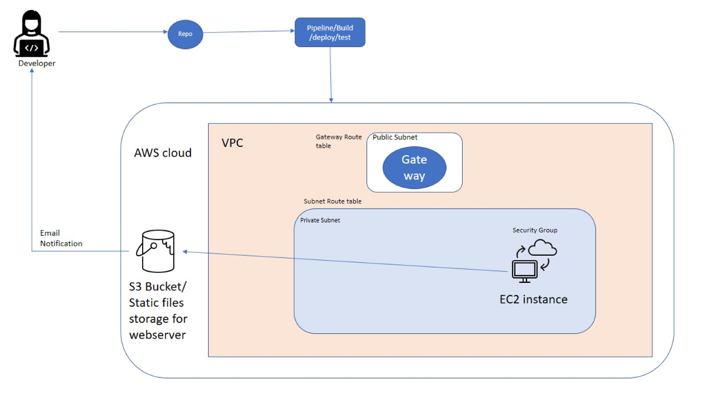
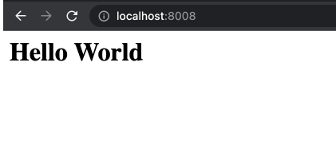

# sre-coding-challenge

## Description
A quick guide to setup this terraform project and how to run terratest tests

### Dependencies

terraform = 1.1.3
go 1.17
helm
minikube
docker

### Step by step

* Log-ing to aws console and create an IAM user with enough priviledges.
* Gather the AWS_ACCESS_KEY_ID and AWS_SECRET_ACCESS_KEY and set them as env variables 
```
export AWS_ACCESS_KEY_ID="<AWS_ACCESS_KEY_ID>"
export AWS_SECRET_ACCESS_KEY="<AWS_SECRET_ACCESS_KEY>"
```
* To run s3 bucket challenge, go to /terraform/s3-challenge directory and run below command in cli
```
terraform init
terraform plan --var-file=env.tfvars
terraform apply --var-file=env.tfvars
```

* To run webserver challenge, go to /terraform/webserver-challenge directory and run below command in cli. It should install apache2 in the ec2 instance and should be availble at server's public ip address over Http protocol.
```
terraform init
terraform plan --var-file=env.tfvars
terraform apply --var-file=env.tfvars
```
* To run the unit-test developed using terratest run the following commands in the /terraform/webserver-challenge directory and run below command in cli.

```
go mod init  github.com/user/repo
go mod tidy -compat=1.17
go test -v -run TestTerraformAwsEC2 -timeout 60m

```

Basically what this unit test does is checking if the webserver is created with the expected instace type.

### Architecture of webServer deployment:



### Code evidence:
The apache webserver page will be availble at server's public ip address over Http protocol.


### Helm Microservice

To install the hello-world web app using helm, in the microservice directory:

change the directory to minikube-project/

```
helm install helloworld helloworld-chart
```


List the application: check the chart version and app version defined in the Chart.yaml file


minikube-project nidhi_pandey$ helm list
| NAME |  NAMESPACE   |    REVISION  |UPDATED                                | STATUS        |  CHART                |   APP VERSION    |
|------|--------------|--------------|---------------------------------------|---------------|-----------------------|------------------|
|helloworld  |    default   |      2      |         2022-03-24 13:57:04.349595 +0000 UTC  |  deployed   |     helloworld-chart-0.1.0 |


check that everything defined in the values file is correct:

deployment,sa,hpa,pods

```
kubectl get deploy
minikube-project nidhi_pandey$ kubectl get deploy
NAME         READY   UP-TO-DATE   AVAILABLE   AGE
helloworld   1/1     1            1           103m

```


## Author
Nidhi Pandey
